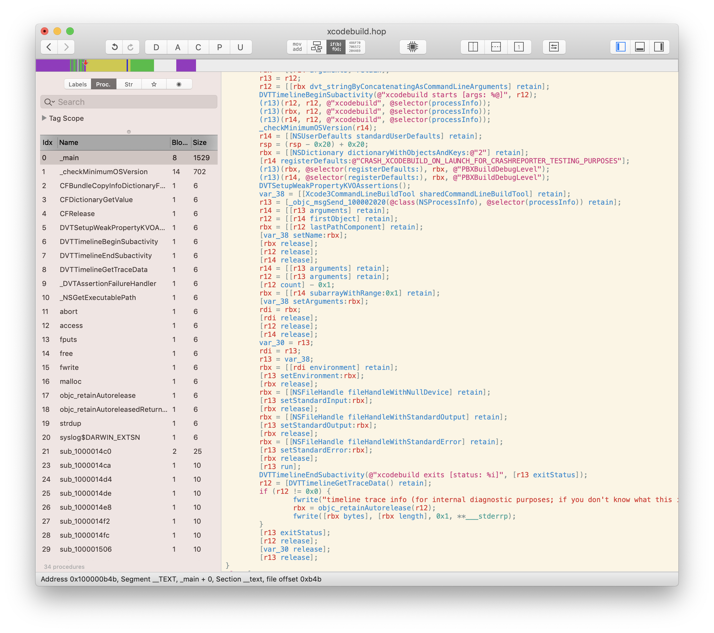
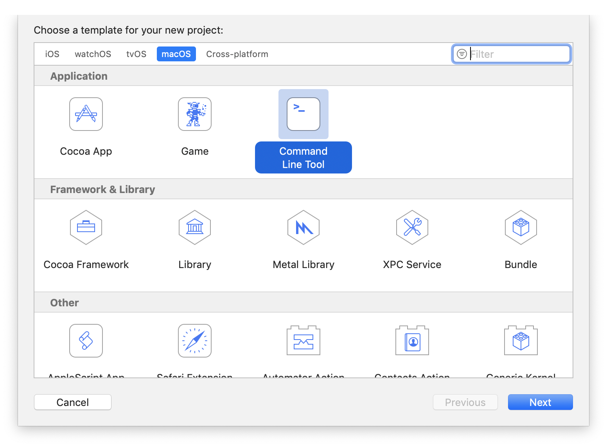
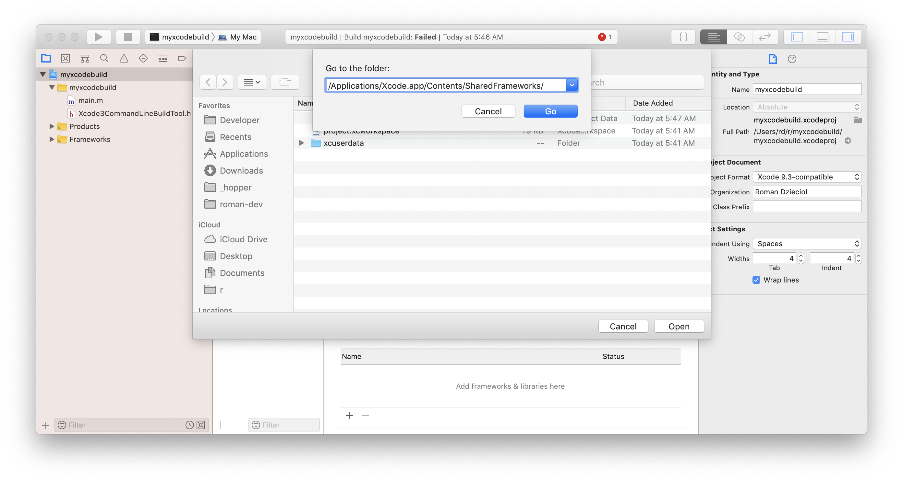
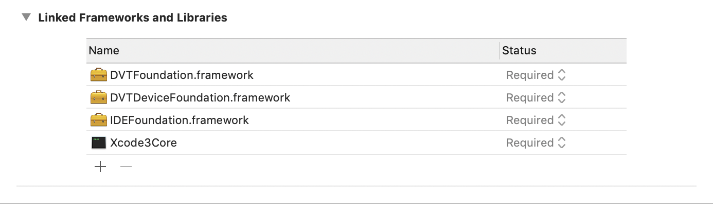
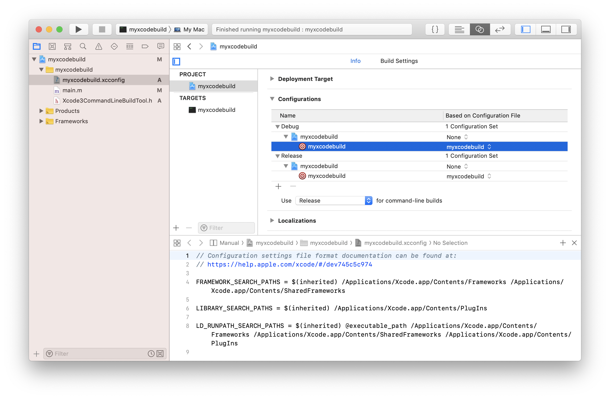
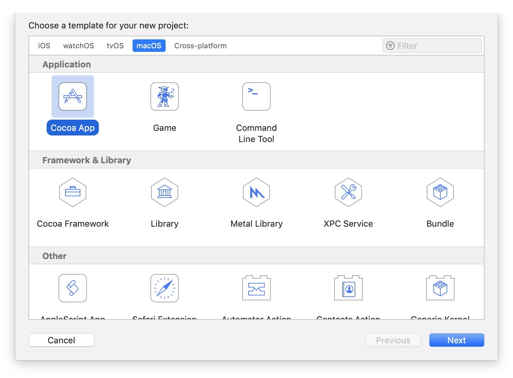
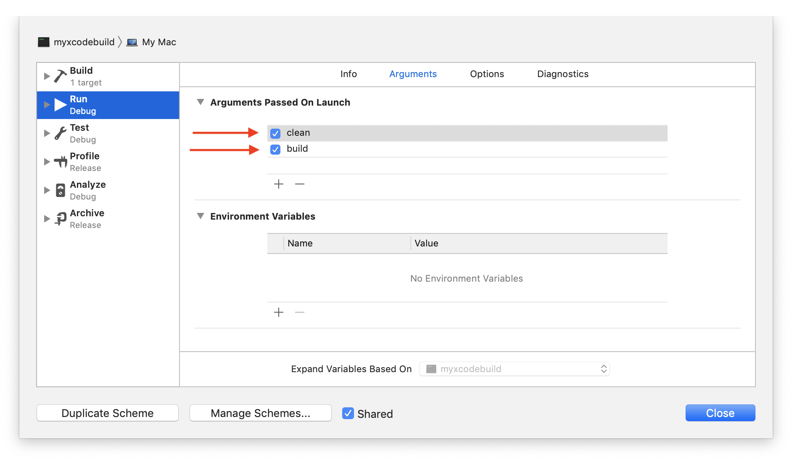
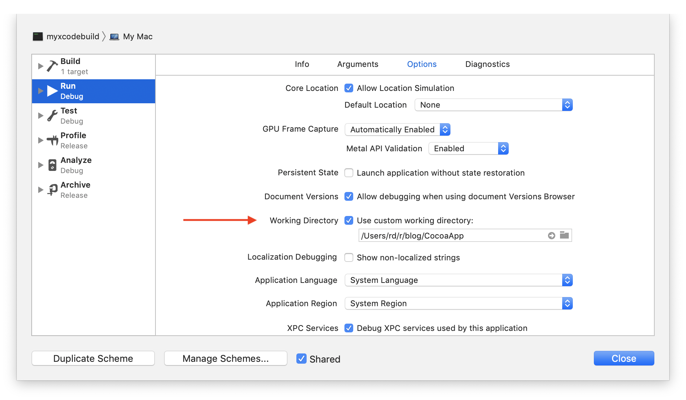
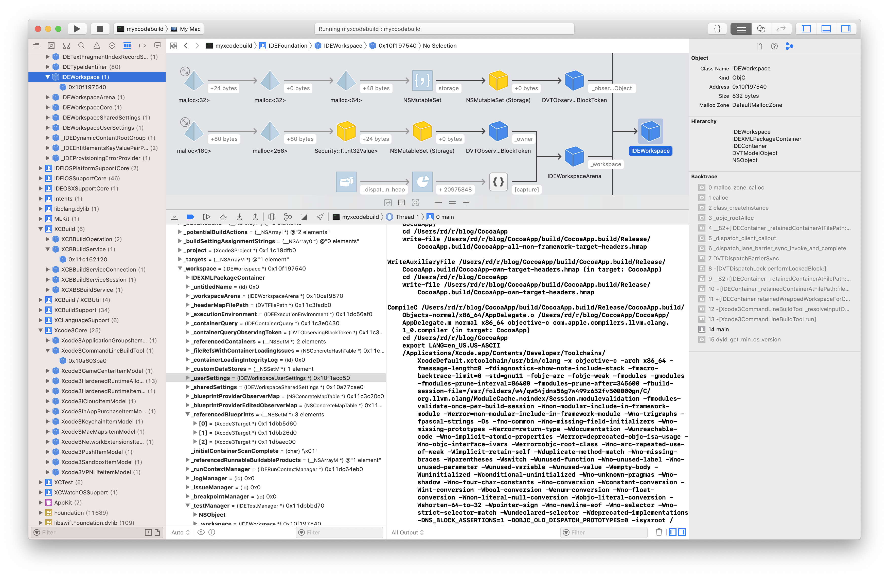
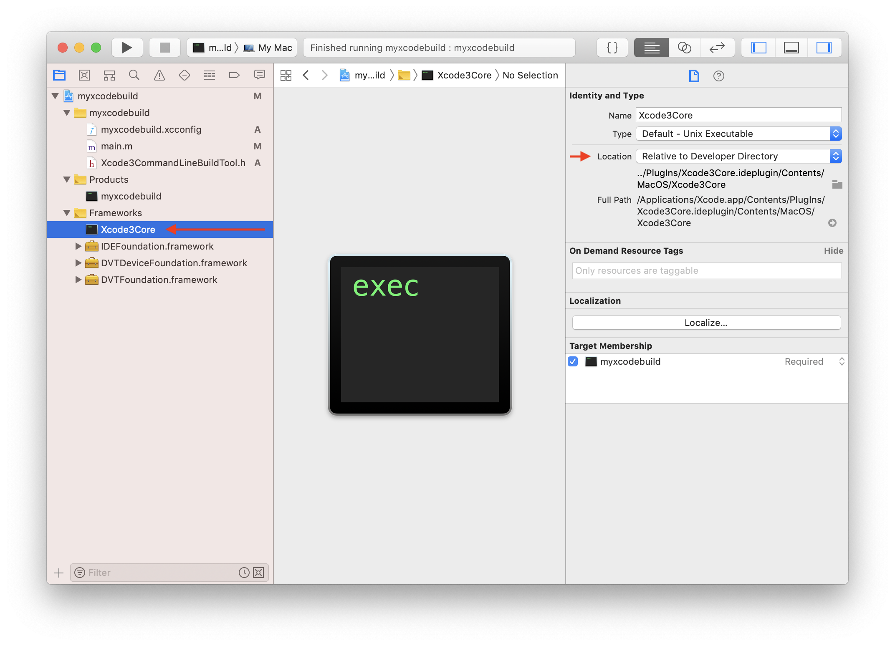

The `xcodebuild` is the tool used to compile iOS & macOS projects from commandline.
 
We can write our own. It's simpler than you think!

## Why?

What if you could modify Xcode so it works just the way you want?

### 🚪 Gain access to Xcode APIs

The Xcode is built from a lot of modular specialized frameworks. Use them in your app any way you want. 

* Modify project files programmaticaly
* Control compilation precisely
* Generate custom outputs efficiently
* Anything Xcode does, you can too, in your own way, in the language you love most

### 💡 Learn how Xcode works internally

*Generate Objective-C pseudo-source-code and framework headers for all of Xcode.*

### 🦋 Debug xcodebuild

*Run your custom `xcodebuild` from within Xcode to debug Apple's frameworks.*

### 📚 Find undocumented features

*If you're curious, you'll find tons of useful undocumented features in Xcode.*

### 🚀 Add new features

*Modify the behavior of Xcode by subclassing and/or swizzling Apple's code.*

### 💯 Remain always 100% compatible with Xcode

*And best of all, unlike 3rd party frameworks, it always works because it is the same code that Xcode IDE uses.*


# Reading the xcodebuild source code
Lets figure out how `xcodebuild` works internally.

## Find xcodebuild binary
To find the `xcodebuild` command that will be run in bash use the `which` command:

```bash
which xcodebuild
/usr/bin/xcodebuild
```

The `/usr/bin/xcodebuild` is a helper for when you have multiple versions of Xcode installed. It will launch the `xcodebuild` version you want, based on your choice set in Xcode Preferences or `xcode-select`. 

*It is very similar to using the `xcrun` command. I will describe how they work internally in upcoming post.*

Use the `xcrun` command to find the `xcodebuild` binary we want:

```bash
xcrun -f xcodebuild
/Applications/Xcode.app/Contents/Developer/usr/bin/xcodebuild
```
## Disassemble the xcodebuild binary

*You don't have to know the assembly language.*

I recommend the [Hopper Disassembler app](https://www.hopperapp.com). It can convert assembly to pseudo code that looks similar to Objective-C. It can also generate Objective-C header files, so that you can see all the methods & properties of all the objects.

***Feel free to skip disassembling and use the snippet below. You can always revisit this later.***

***PS: If you haven't heard about Grace Hopper, go read about her now: [https://en.wikipedia.org/wiki/Grace_Hopper](https://en.wikipedia.org/wiki/Grace_Hopper)***



### The main() method
In the main method, we will find that 80% of the code is just:

`gist:roman-dzieciol/8f4d2c91d28854d6e3a0c970a9697a2f?file=main.m`

# Create a myxcodebuild commandline tool


Lets start by creating a new macOS commandline tool called `myxcodebuild`. Use Objective-C rather than Swift as the language.

## Add Xcode framework headers

The Xcode frameworks do not include headers, so lets write or generate our own ones.

* You don't have to declare all the objects
* You don't have to declare all the methods & properties
* You can change type of any object property to `id`
* You can forward declare any object type with `@class Type;`
* You can forward declare any interface type with `@protocol Type;`

***Declare just the parts you want.***


### Add Xcode3CommandLineBuildTool.h

Lets add a `Xcode3CommandLineBuildTool.h` header:

`gist:roman-dzieciol/8f4d2c91d28854d6e3a0c970a9697a2f?file=Xcode3CommandLineBuildTool.h`

This will let the compiler know that such object exists in one of the frameworks.

*Later it's useful to have access to all the methods and properties of `Xcode3CommandLineBuildTool`. The Hopper app can generate complete private headers.*


## Implement the main method

Add the decompiled snippet to the main method in `main.m`:

`gist:roman-dzieciol/8f4d2c91d28854d6e3a0c970a9697a2f?file=main.m`


# Compile myxcodebuild

To compile succesfully `myxcodebuild` needs to be linked with all the required frameworks.

## Find xcodebuild dependencies

Each macOS binary usually has a list of dependencies inside of it.

One way to read the `xcodebuild` dependencies is:

	otool -l /Applications/Xcode.app/Contents/Developer/usr/bin/xcodebuild
	
This will output a list of load commands present in the binary, among them library dependencies and their search paths:

```
...
Load command 12
          cmd LC_LOAD_DYLIB
      cmdsize 96
         name /System/Library/Frameworks/Foundation.framework/Versions/C/Foundation (offset 24)
   time stamp 2 Thu Jan  1 01:00:02 1970
      current version 1555.10.0
compatibility version 300.0.0
...
Load command 23
          cmd LC_RPATH
      cmdsize 48
         path @executable_path/../../../PlugIns (offset 12)
...
```

### Find libraries used by xcodebuild

The `LC_LOAD_DYLIB` load commands define the libraries that this binary will load on launch:

```
name /System/Library/Frameworks/Foundation.framework/Versions/C/Foundation
name @rpath/DVTFoundation.framework/Versions/A/DVTFoundation
name @rpath/DVTDeviceFoundation.framework/Versions/A/DVTDeviceFoundation
name @rpath/IDEFoundation.framework/Versions/A/IDEFoundation 
name @rpath/Xcode3Core.ideplugin/Contents/MacOS/Xcode3Core
name /usr/lib/libSystem.B.dylib
name /System/Library/Frameworks/CoreFoundation.framework/Versions/A/CoreFoundation 
```

There are 3 Xcode frameworks loaded directly: `DVTFoundation`, `DVTDeviceFoundation`, `IDEFoundation` and a `Xcode3Core` plugin, which is very similar to a framework. 

### Find library search paths used by xcodebuild

The `LC_RPATH` load commands define the search locations (the `@rpath`) for libraries:

```
path @executable_path/
path @executable_path/../../../Frameworks
path @executable_path/../../../SharedFrameworks
path @executable_path/../../../PlugIns
```

When macOS is loading a dependency with `@rpath` in the `LC_LOAD_DYLIB` path name, it will try all of those search paths in order.

Those are relative to location of `xcodebuild` inside Xcode.app bundle, effectively:

```
/Applications/Xcode.app/Contents/Developer/usr/bin/
/Applications/Xcode.app/Contents/Frameworks/
/Applications/Xcode.app/Contents/SharedFrameworks/
/Applications/Xcode.app/Contents/PlugIns/
```

## Add libraries as dependencies to myxcodebuild

We can use the Xcode libraries as they are inside Xcode.app, we don't need to copy them.

Tip: The `Linked Frameworks And Libraries` list on the `General` tab of `myxcodebuild` target can add frameworks which aren't on the list. Use the `Add Other...` button to locate them. 

To navigate inside the Xcode.app bundle press `Command+Shift+G` in the picker window and paste the path to directory in which framework is located:




### Add Xcode Plugins

For plugins we need to add the binary directly rather than adding the directory.

Add `Xcode3Core` binary to `Linked Frameworks And Libraries` using the `Add Other...` button:

* `/Applications/Xcode.app/Contents/PlugIns/Xcode3Core.ideplugin/Contents/MacOS/Xcode3Core`

### Add Xcode Frameworks

Add framework bundles to `Linked Frameworks And Libraries` using the `Add Other...` button:

* `/Applications/Xcode.app/Contents/Frameworks/IDEFoundation.framework`
* `/Applications/Xcode.app/Contents/SharedFrameworks/DVTDeviceFoundation.framework`
* `/Applications/Xcode.app/Contents/SharedFrameworks/DVTFoundation.framework`

### Verify library order

The order in which libraries are listed is important - they should appear on the `Linked Frameworks And Libraries` list in the order they are listed in `otool -l`.

*You can have them in another order, but this may require adding more search paths.*


## Add custom build settings

Lets use an xcconfig file to keep new custom build settings in one place.



### Add Framework search paths

For the project to compile, linker needs to know where to find the frameworks:

```
FRAMEWORK_SEARCH_PATHS = $(inherited) /Applications/Xcode.app/Contents/Frameworks /Applications/Xcode.app/Contents/SharedFrameworks

LIBRARY_SEARCH_PATHS = $(inherited) /Applications/Xcode.app/Contents/PlugIns
```

### Add @rpath search paths

The frameworks will be loaded from specific locations when `myxcodebuild` is launched:
	
```
LD_RUNPATH_SEARCH_PATHS = @executable_path /Applications/Xcode.app/Contents/Frameworks /Applications/Xcode.app/Contents/SharedFrameworks /Applications/Xcode.app/Contents/PlugIns
```

# Launching myxcodebuild

Our myxcodebuild is now ready!

As bonus, lets launch and debug it from within Xcode.

We need a project on which it can be tested, feel free to use your own or create a sample app.


## Create a sample app to be compiled

A basic Cocoa App will do:


## Compile Cocoa App with myxcodebuild

Our myxcodebuild works just like xcodebuild.

Lets launch it within Cocoa App folder and do a clean build:




Now we can watch our xcodebuild compiling our app while it's being debugged inside Xcode 😃



And that's it! Now you have your own personal xcodebuild and access to all of Xcode internals.

*This article is just a first step in long series. I'm happy to help & support you with building new things in the languages we* ❤️ *most. Feel free to ping me on Twitter.*

*Happy programming!*

# Appendix: myxcodebuild on GitHub

[https://github.com/roman-dzieciol/myxcodebuild](https://github.com/roman-dzieciol/myxcodebuild)

# Appendix: Make Xcode project work in any location

Once frameworks are added, they will appear in the Xcode Project Navigator on the left. 

By default paths to newly added frameworks will be relative to the project file, which will break if the project is moved. 

***We can make them relative to the Xcode.app Developer Directory so that it will work in any location.***



# Appendix: Complete Xcode3CommandLineBuildTool.h

Here is `Xcode3CommandLineBuildTool.h` in full:

`gist:roman-dzieciol/8f4d2c91d28854d6e3a0c970a9697a2f?file=Xcode3CommandLineBuildTool.complete.h`

***I can't wait to see what you will create*** 😊 ***And there's so much more where that came from!***
